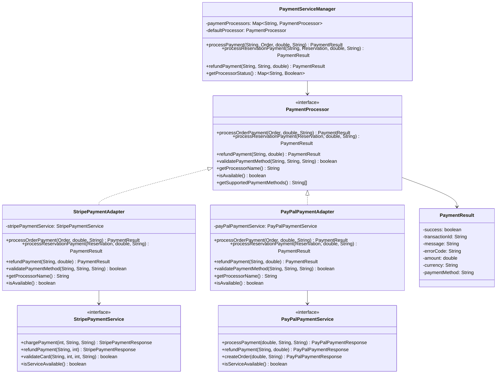

# Adapter Pattern Implementation - Restaurant Management System

## Overview

This document describes the implementation of the **Adapter Pattern** in the Restaurant Management System's payment processing subsystem. The Adapter Pattern has been integrated to provide seamless integration with multiple payment providers (Stripe, PayPal) without modifying existing client code.

## Design Pattern Benefits

### 1. **Interface Compatibility**
- Allows integration of third-party payment services with different interfaces
- Provides a unified interface for all payment operations
- Enables easy switching between payment providers

### 2. **Maintainability**
- Changes to third-party services don't affect client code
- Each payment provider is encapsulated in its own adapter
- Clear separation of concerns between payment logic and business logic

### 3. **Extensibility**
- Easy to add new payment providers without modifying existing code
- Follows Open/Closed Principle
- Supports multiple payment methods simultaneously

### 4. **Testability**
- Each adapter can be tested independently
- Easy to mock payment services for unit testing
- Clear interfaces make testing straightforward

## Architecture

### Class Diagram



## Implementation Details

### 1. Target Interface (PaymentProcessor)

```java
public interface PaymentProcessor {
    PaymentResult processOrderPayment(Order order, double amount, String paymentMethod);
    PaymentResult processReservationPayment(Reservation reservation, double amount, String paymentMethod);
    PaymentResult refundPayment(String transactionId, double amount);
    boolean validatePaymentMethod(String paymentMethod, String cardNumber, String expiryDate);
    String getProcessorName();
    boolean isAvailable();
    String[] getSupportedPaymentMethods();
}
```

### 2. Adaptee Interfaces (Third-Party Services)

#### Stripe Payment Service
```java
public interface StripePaymentService {
    StripePaymentResponse chargePayment(int amountInCents, String currency, String paymentMethodId);
    StripePaymentResponse refundPayment(String chargeId, int amountInCents);
    boolean validateCard(String cardNumber, int expiryMonth, int expiryYear, String cvc);
    boolean isServiceAvailable();
}
```

#### PayPal Payment Service
```java
public interface PayPalPaymentService {
    PayPalPaymentResponse processPayment(double amount, String currency, String paymentMethod);
    PayPalPaymentResponse refundPayment(String transactionId, double amount);
    PayPalPaymentResponse createOrder(double amount, String currency);
    boolean isServiceAvailable();
}
```

### 3. Adapter Classes

#### Stripe Payment Adapter
```java
@Component
public class StripePaymentAdapter implements PaymentProcessor {
    @Autowired
    private StripePaymentService stripePaymentService;
    
    @Override
    public PaymentResult processOrderPayment(Order order, double amount, String paymentMethod) {
        // Convert amount to cents (Stripe uses cents)
        int amountInCents = (int) (amount * 100);
        
        // Call Stripe service
        StripePaymentResponse response = stripePaymentService.chargePayment(
            amountInCents, "USD", generatePaymentMethodId(paymentMethod));
        
        // Convert Stripe response to our PaymentResult
        return convertStripeResponse(response, amount, paymentMethod);
    }
    
    // ... other methods
}
```

#### PayPal Payment Adapter
```java
@Component
public class PayPalPaymentAdapter implements PaymentProcessor {
    @Autowired
    private PayPalPaymentService payPalPaymentService;
    
    @Override
    public PaymentResult processOrderPayment(Order order, double amount, String paymentMethod) {
        // Call PayPal service
        PayPalPaymentResponse response = payPalPaymentService.processPayment(
            amount, "USD", paymentMethod);
        
        // Convert PayPal response to our PaymentResult
        return convertPayPalResponse(response, amount, paymentMethod);
    }
    
    // ... other methods
}
```

### 4. Payment Service Manager

```java
@Service
public class PaymentServiceManager {
    private final Map<String, PaymentProcessor> paymentProcessors = new HashMap<>();
    private PaymentProcessor defaultProcessor;
    
    public PaymentResult processPayment(String processorName, Order order, 
                                      double amount, String paymentMethod) {
        PaymentProcessor processor = getProcessor(processorName);
        if (processor == null || !processor.isAvailable()) {
            return PaymentResult.failure("PROCESSOR_NOT_FOUND", 
                "Payment processor not found or unavailable");
        }
        
        return processor.processOrderPayment(order, amount, paymentMethod);
    }
    
    // ... other methods
}
```

## Configuration

### Application Properties

```properties
# Payment Processing Configuration (Adapter Pattern)
payment.default.processor=stripe
payment.processors.available=stripe,paypal
payment.currency.default=USD
```

### Processor Selection

1. **Default Processor**: Set via `payment.default.processor` property
2. **Runtime Selection**: Can be specified when processing payments
3. **Automatic Fallback**: Falls back to first available processor if default fails

## Usage Examples

### 1. Basic Usage (Default Processor)

```java
@Autowired
private PaymentServiceManager paymentServiceManager;

// Uses default processor (Stripe)
PaymentResult result = paymentServiceManager.processPayment(order, 50.00, "credit_card");
```

### 2. Specific Processor Usage

```java
// Use specific processor
PaymentResult result = paymentServiceManager.processPayment("paypal", order, 50.00, "paypal");
```

### 3. Reservation Payment

```java
// Process reservation deposit
PaymentResult result = paymentServiceManager.processReservationPayment(
    "stripe", reservation, 25.00, "credit_card");
```

### 4. Payment Refund

```java
// Refund payment
PaymentResult result = paymentServiceManager.refundPayment("stripe", transactionId, 25.00);
```

## Testing

### Test Endpoints

The implementation includes test endpoints for demonstration and testing:

- `POST /api/payment-test/process/{processor}` - Test specific processor
- `POST /api/payment-test/process` - Test default processor
- `POST /api/payment-test/reservation/{processor}` - Test reservation payment
- `POST /api/payment-test/refund/{processor}` - Test payment refund
- `POST /api/payment-test/validate/{processor}` - Test payment validation
- `GET /api/payment-test/processors/status` - Get processor status
- `POST /api/payment-test/processors/default/{processor}` - Change default processor
- `POST /api/payment-test/test-all-processors` - Test all processors

### Example Test Requests

```bash
# Test Stripe processor
curl -X POST http://localhost:8081/api/payment-test/process/stripe

# Test PayPal processor
curl -X POST http://localhost:8081/api/payment-test/process/paypal

# Test reservation payment
curl -X POST http://localhost:8081/api/payment-test/reservation/stripe

# Get processor status
curl -X GET http://localhost:8081/api/payment-test/processors/status

# Test all processors
curl -X POST http://localhost:8081/api/payment-test/test-all-processors
```

## Benefits Achieved

### 1. **Seamless Integration**
- Easy integration of multiple payment providers
- Unified interface for all payment operations
- No changes required to client code when adding new providers

### 2. **Flexibility**
- Can switch between payment providers at runtime
- Support for different payment methods per provider
- Easy configuration of default processor

### 3. **Maintainability**
- Each payment provider is isolated in its own adapter
- Changes to third-party services don't affect business logic
- Clear separation of concerns

### 4. **Extensibility**
- Easy to add new payment providers (Square, Apple Pay, etc.)
- No need to modify existing code when adding new providers
- Follows SOLID principles

### 5. **Testing**
- Each adapter can be unit tested independently
- Easy to mock payment services for integration testing
- Clear test boundaries and responsibilities

## Real-World Integration

### Stripe Integration
```java
// Real Stripe integration would use:
// - Stripe Java SDK
// - Stripe Elements for frontend
// - Webhook handling for payment confirmations
// - Proper error handling and retry logic
```

### PayPal Integration
```java
// Real PayPal integration would use:
// - PayPal Java SDK
// - PayPal Checkout for frontend
// - Webhook handling for payment confirmations
// - Proper error handling and retry logic
```

## Future Enhancements

### 1. **Additional Payment Providers**
- Square payment adapter
- Apple Pay adapter
- Google Pay adapter
- Cryptocurrency payment adapter

### 2. **Advanced Features**
- Payment method tokenization
- Recurring payment support
- Payment analytics and reporting
- Fraud detection integration

### 3. **Configuration Management**
- Dynamic processor configuration
- A/B testing for payment providers
- Performance-based processor selection
- Geographic-based processor routing

## Conclusion

The Adapter Pattern implementation in the Restaurant Management System's payment processing subsystem provides:

- **Seamless integration** with multiple payment providers
- **Unified interface** for all payment operations
- **Easy extensibility** for new payment providers
- **Maintainable and testable** code structure
- **Flexible configuration** and runtime selection

This implementation demonstrates how design patterns can significantly improve code quality, maintainability, and extensibility in real-world applications. The payment system is now ready to handle multiple payment providers and can easily accommodate future enhancements without major refactoring.

The Adapter Pattern has successfully solved the problem of integrating third-party services with incompatible interfaces, making the system more robust and flexible for future growth.
