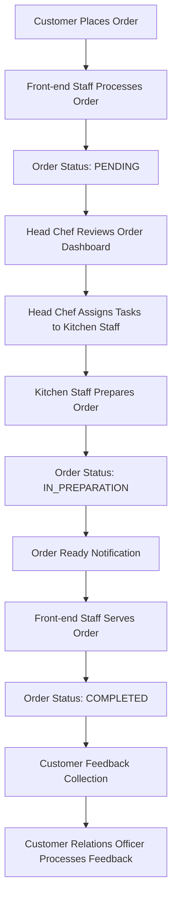
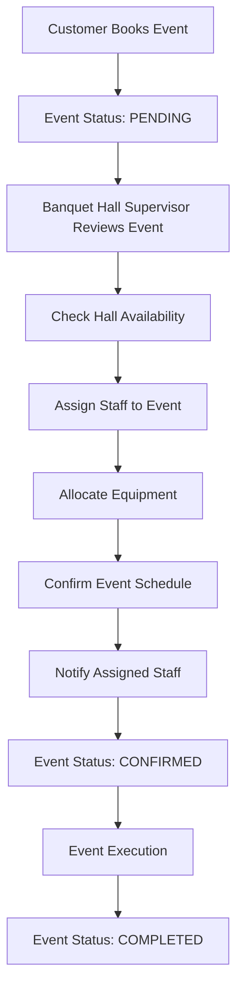
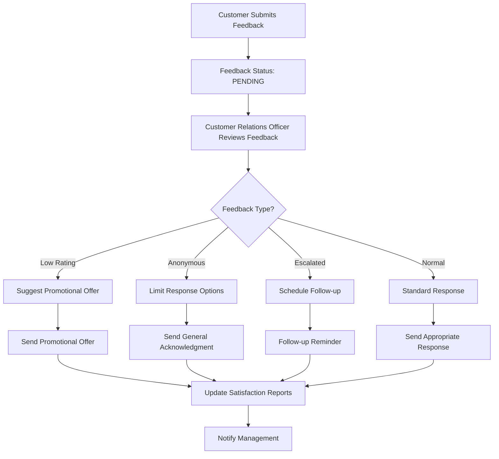

# 🍽️ Complete Restaurant Management System - Function Mapping & Integration

## 📋 System Overview

This comprehensive restaurant management system integrates multiple user roles and functionalities to provide end-to-end restaurant operations management. The system is built using Spring Boot with a modern web interface and real-time capabilities.

## 🎭 User Roles & Access Control

### 1. **Manager** (`MANAGER`)
- **Access**: Full system access
- **Dashboard**: `/manager/dashboard`
- **Functions**: All management functions, user management, system configuration

### 2. **Head Chef** (`CHEF`)
- **Access**: Kitchen operations, order management
- **Dashboard**: `/kitchen/dashboard`
- **Functions**: Real-time order dashboard, task assignment, inventory management

### 3. **Banquet Hall Supervisor** (`BANQUET_SUPERVISOR`)
- **Access**: Event management, resource allocation
- **Dashboard**: `/banquet/dashboard`
- **Functions**: Event scheduling, staff/equipment assignment, hall management

### 4. **Customer Relations Officer** (`CUSTOMER_RELATIONS_OFFICER`)
- **Access**: Feedback management, customer satisfaction
- **Dashboard**: `/customer-relations/dashboard`
- **Functions**: Feedback processing, response management, satisfaction reporting

### 5. **Kitchen Staff** (`KITCHEN_STAFF`)
- **Access**: Task management, order preparation
- **Functions**: Task updates, preparation workflow

### 6. **Front-end Staff** (`FRONT_END_STAFF`)
- **Access**: Order management, customer service
- **Functions**: Order processing, customer notifications

## 🔄 Complete Function Flow Mapping

### **Order Management Flow**

### **Event Management Flow**

### **Feedback Management Flow**

## 🏗️ System Architecture

### **Backend Components**

#### **Models (Data Layer)**
- `User` - User authentication and roles
- `Order` - Order management
- `OrderItem` - Individual order items
- `KitchenTask` - Kitchen task management
- `InventoryItem` - Inventory tracking
- `EventBooking` - Event reservations
- `EventStaffAssignment` - Staff allocation to events
- `EventEquipment` - Equipment allocation
- `CustomerFeedback` - Customer feedback
- `FeedbackResponse` - Response management
- `SatisfactionReport` - Analytics and reporting
- `Reservation` - Table reservations
- `Schedule` - Staff scheduling
- `Staff` - Staff management

#### **Repositories (Data Access Layer)**
- `UserRepository` - User data access
- `OrderRepository` - Order data access
- `KitchenTaskRepository` - Task data access
- `InventoryItemRepository` - Inventory data access
- `EventBookingRepository` - Event data access
- `EventStaffAssignmentRepository` - Staff assignment data access
- `EventEquipmentRepository` - Equipment data access
- `CustomerFeedbackRepository` - Feedback data access
- `FeedbackResponseRepository` - Response data access
- `SatisfactionReportRepository` - Report data access
- `ReservationRepository` - Reservation data access
- `ScheduleRepository` - Schedule data access
- `StaffRepository` - Staff data access

#### **Services (Business Logic Layer)**
- `userService` - User management
- `OrderService` - Order processing
- `KitchenService` - Kitchen operations
- `InventoryService` - Inventory management
- `EventBookingService` - Event management
- `BanquetHallService` - Banquet operations
- `CustomerRelationsService` - Feedback management
- `NotificationService` - Communication system
- `ReservationService` - Table management
- `ScheduleService` - Staff scheduling

#### **Controllers (Presentation Layer)**
- `ManagerController` - Management functions
- `KitchenController` - Kitchen operations
- `EventController` - Event booking
- `BanquetHallController` - Banquet management
- `CustomerRelationsController` - Feedback management
- `ReservationController` - Table reservations
- `ScheduleController` - Staff scheduling

### **Frontend Components**

#### **Templates (Thymeleaf)**
- `manager/dashboard.html` - Management dashboard
- `kitchen/dashboard.html` - Kitchen operations dashboard
- `events/booking.html` - Event booking interface
- `banquet/dashboard.html` - Banquet management dashboard
- `customer-relations/dashboard.html` - Feedback management dashboard
- `reservations/dashboard.html` - Reservation management
- `schedule/dashboard.html` - Staff scheduling

#### **Shared Components**
- `login.html` - Authentication
- `dashboard.html` - Main dashboard
- `layout.html` - Common layout template

## 🔧 Core Functionalities by Role

### **1. Manager Functions**

#### **User Management**
- Create, update, delete user accounts
- Assign roles and permissions
- Manage staff information
- Handle authentication and authorization

#### **System Configuration**
- Configure restaurant settings
- Manage menu items and pricing
- Set up inventory parameters
- Configure notification settings

#### **Analytics & Reporting**
- View comprehensive system reports
- Monitor performance metrics
- Track customer satisfaction
- Analyze operational efficiency

### **2. Head Chef Functions**

#### **Real-time Order Dashboard**
- View pending orders with real-time updates
- Monitor order status and progress
- Track preparation times
- Handle order modifications

#### **Task Management**
- Assign preparation tasks to kitchen staff
- Monitor task completion
- Handle task delays and issues
- Update order statuses

#### **Inventory Management**
- Monitor ingredient levels
- Track low stock items
- Request restocking
- Manage inventory alerts

#### **Staff Coordination**
- Assign staff to specific tasks
- Monitor staff availability
- Handle staff scheduling conflicts
- Coordinate with front-end staff

### **3. Banquet Hall Supervisor Functions**

#### **Event Management**
- Review upcoming events
- Check hall availability
- Manage event bookings
- Handle event modifications

#### **Resource Allocation**
- Assign staff to events
- Allocate equipment and resources
- Manage resource conflicts
- Track resource utilization

#### **Schedule Management**
- Confirm event schedules
- Handle schedule conflicts
- Notify assigned staff
- Manage event timelines

#### **Hall Operations**
- Monitor hall status
- Handle booking conflicts
- Manage equipment maintenance
- Coordinate with other departments

### **4. Customer Relations Officer Functions**

#### **Feedback Management**
- Review pending feedback entries
- Process customer complaints
- Handle feedback responses
- Manage feedback escalation

#### **Customer Communication**
- Send response notifications
- Handle promotional offers
- Manage customer inquiries
- Coordinate with other departments

#### **Satisfaction Reporting**
- Generate satisfaction reports
- Track customer satisfaction metrics
- Identify improvement areas
- Report to management

#### **Issue Resolution**
- Handle escalated issues
- Coordinate with relevant departments
- Track resolution progress
- Follow up on resolutions

### **5. Kitchen Staff Functions**

#### **Task Execution**
- View assigned tasks
- Update task status
- Report task completion
- Handle task issues

#### **Order Preparation**
- Prepare assigned order items
- Update preparation progress
- Coordinate with other staff
- Maintain quality standards

#### **Communication**
- Report delays or issues
- Coordinate with head chef
- Update order status
- Handle special requests

### **6. Front-end Staff Functions**

#### **Order Processing**
- Take customer orders
- Process order payments
- Update order status
- Handle order modifications

#### **Customer Service**
- Serve completed orders
- Handle customer inquiries
- Manage table service
- Process customer feedback

#### **Coordination**
- Coordinate with kitchen staff
- Update order status
- Handle customer requests
- Manage service flow

## 🔄 Integration Points

### **Order to Kitchen Integration**
- Real-time order updates from front-end to kitchen
- Task assignment from head chef to kitchen staff
- Status updates from kitchen to front-end
- Notification system for order readiness

### **Event to Banquet Integration**
- Event booking to banquet hall management
- Staff assignment coordination
- Resource allocation management
- Schedule confirmation workflow

### **Feedback to Management Integration**
- Customer feedback collection
- Response management workflow
- Satisfaction reporting to management
- Issue escalation and resolution

### **Cross-Department Communication**
- Notification system for all departments
- Real-time updates across the system
- Status synchronization
- Alert and reminder system

## 📊 Database Schema Overview

### **Core Tables**
- `users` - User authentication and roles
- `orders` - Order management
- `order_items` - Order item details
- `kitchen_tasks` - Kitchen task management
- `inventory_items` - Inventory tracking
- `event_bookings` - Event reservations
- `event_staff_assignments` - Staff allocation
- `event_equipment` - Equipment allocation
- `customer_feedback` - Customer feedback
- `feedback_responses` - Response management
- `satisfaction_reports` - Analytics
- `reservations` - Table reservations
- `schedules` - Staff scheduling
- `staff` - Staff information

### **Relationships**
- Users have roles and permissions
- Orders contain order items
- Kitchen tasks are assigned to orders
- Events have staff assignments and equipment
- Feedback has responses and reports
- Schedules manage staff availability

## 🚀 System Features

### **Real-time Capabilities**
- Live order updates
- Real-time dashboard refresh
- Instant notifications
- Live status tracking

### **Notification System**
- Email notifications
- In-app alerts
- SMS capabilities (extensible)
- Push notifications (extensible)

### **Analytics & Reporting**
- Comprehensive reporting
- Real-time statistics
- Trend analysis
- Performance metrics

### **Security Features**
- Role-based access control
- Secure authentication
- Data encryption
- Audit logging

### **User Experience**
- Responsive design
- Intuitive interfaces
- Real-time updates
- Professional styling

## 🔧 Technical Stack

### **Backend**
- **Framework**: Spring Boot 3.x
- **Security**: Spring Security
- **Database**: JPA/Hibernate with SQL Server
- **Templating**: Thymeleaf
- **Email**: JavaMailSender
- **Async Processing**: @Async annotations

### **Frontend**
- **CSS Framework**: Bootstrap 5.3
- **Icons**: Font Awesome 6.0
- **JavaScript**: jQuery 3.6
- **Charts**: Chart.js (extensible)
- **Real-time**: AJAX polling

### **Database**
- **Primary**: SQL Server
- **Schema**: Comprehensive relational design
- **Indexing**: Optimized for performance
- **Constraints**: Data integrity enforcement

## 📈 Performance & Scalability

### **Optimization Features**
- Database indexing
- Lazy loading
- Caching strategies
- Async processing
- Connection pooling

### **Scalability Considerations**
- Microservices ready
- Load balancing support
- Database sharding ready
- Horizontal scaling support

## 🔒 Security Implementation

### **Authentication & Authorization**
- Spring Security integration
- Role-based access control
- Session management
- Password encryption

### **Data Protection**
- Input validation
- SQL injection prevention
- XSS protection
- CSRF protection

## 📱 Mobile Responsiveness

### **Responsive Design**
- Bootstrap grid system
- Mobile-first approach
- Touch-friendly interfaces
- Cross-device compatibility

## 🎯 Future Enhancements

### **Planned Features**
- Mobile app development
- Advanced analytics
- AI-powered recommendations
- Integration with POS systems
- Advanced reporting tools

### **Extensibility**
- Plugin architecture
- API development
- Third-party integrations
- Custom reporting

## 📋 Deployment Checklist

### **Prerequisites**
- Java 17+
- SQL Server database
- SMTP server for notifications
- Web server (Tomcat embedded)

### **Configuration**
- Database connection settings
- Email server configuration
- Security settings
- Application properties

### **Monitoring**
- Application logs
- Performance metrics
- Error tracking
- User activity monitoring

---

## 🎉 Conclusion

This comprehensive restaurant management system provides a complete solution for managing all aspects of restaurant operations. The system integrates multiple user roles, real-time capabilities, and advanced features to create an efficient, scalable, and user-friendly platform for restaurant management.

The modular architecture allows for easy maintenance and future enhancements, while the comprehensive feature set addresses all major restaurant management needs from order processing to customer satisfaction management.
