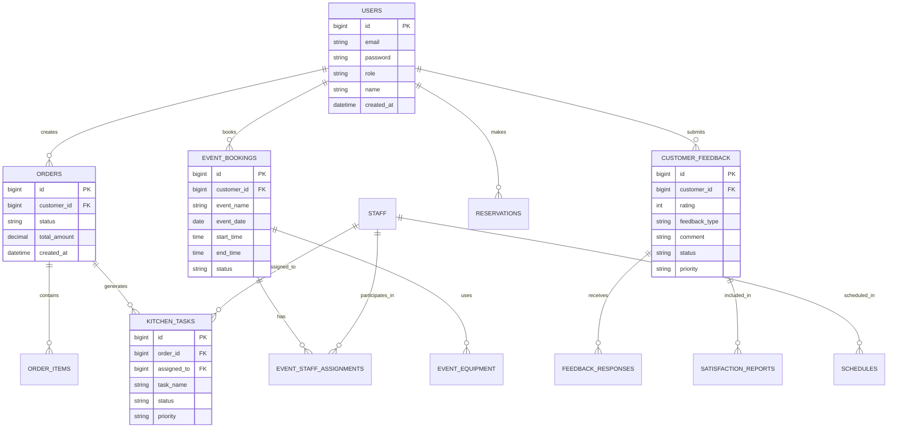

# 🍽️ Restaurant Management System - Integration Diagram

## 📊 Complete System Architecture

## 🔄 Complete User Flow Integration

## 🏗️ Module Integration Map

## 🔄 Real-time Data Flow

## 🎭 Role-Based Access Integration

## 📊 Database Integration Map

## 🔧 API Integration Points

## 🚀 System Deployment Architecture

## 📈 Performance Monitoring Integration

---

## 🎯 Integration Summary

This comprehensive integration diagram shows how all components of the Restaurant Management System work together:

1. **Frontend Layer**: Multiple dashboards for different user roles
2. **Controller Layer**: REST API endpoints for each module
3. **Service Layer**: Business logic and processing
4. **Repository Layer**: Data access and persistence
5. **Database Layer**: Structured data storage
6. **External Services**: Email, notifications, and monitoring

The system is designed with:
- **Modular Architecture**: Each module can be developed and maintained independently
- **Real-time Updates**: Live data synchronization across all components
- **Role-based Access**: Secure access control for different user types
- **Scalable Design**: Can be extended and scaled as needed
- **Comprehensive Integration**: All modules work together seamlessly

This integration ensures efficient restaurant operations management with real-time capabilities, proper security, and excellent user experience.
